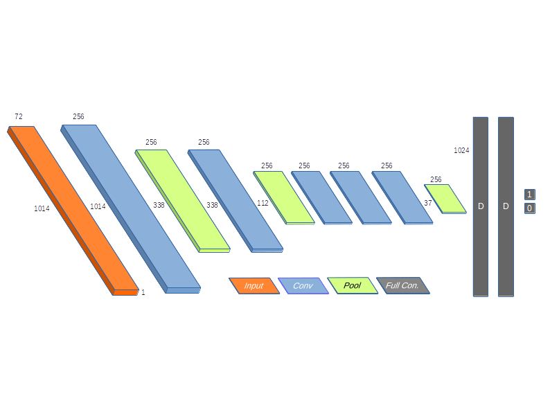

# explainable charCnn for sentiment classification 
Implementation of character CNN by LeCunn et. al. for an university talk. Pimped with LIME to make the predictions of the black box charCNN more accessible and localy interpretable. Also, a small flask App is included for demonstration purposes. 

This readme is structured as follows:

1. Basic idea of CNNs for text classification
2. Implementation 
3. Basic idea of LIME
4. How to: handle those scripts

Work in progress

## 1. CNNs for text classification

1D convolution over character-encoded text. Example with the text "text mining":

## 2. Implementation

Implementation of the small charCnn by [Zhang, Zhao LeCunn 2015](https://arxiv.org/abs/1509.01626) following this architecture:

Used the [Yelp Polarity Data Set](https://drive.google.com/drive/folders/0Bz8a_Dbh9Qhbfll6bVpmNUtUcFdjYmF2SEpmZUZUcVNiMUw1TWN6RDV3a0JHT3kxLVhVR2M) to detect the sentiment of Yelp reviews.

## 3. LIME

Use of the fantastic [LIME package](https://github.com/marcotcr/lime) to make some sense out of the local predictions of the charCnn. 

## 4. How to: handle the scripts

